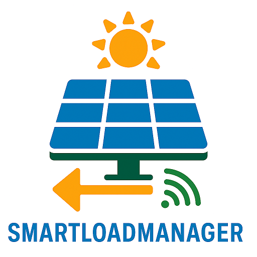

# ioBroker.smartloadmanager

**Tests:** 

## 🔧 Beschreibung

Der Adapter **smartloadmanager** dient der dynamischen Steuerung von Verbrauchern anhand eines PV-Einspeisewertes. Ziel ist es, Überschuss-Strom lokal zu verbrauchen und so die Einspeisung ins öffentliche Netz zu minimieren oder vollständig zu vermeiden. Er unterstützt sowohl Ein/Aus-Verbraucher als auch prozentual regelbare Geräte und Batteriespeicher.

---

## 🚀 Funktionen

- ✅ Überwachung eines konfigurierbaren Einspeisungs-Datenpunkts
- ✅ Dynamische Zuschaltung von Verbrauchern bei Überschuss
- ✅ Dynamische Abschaltung bei Defizit oder Netzbezug
- ✅ Unterstützt **binary**, **percent** und **battery**-Verbraucher
- ✅ Prozentregelung mit Verzögerung (sanftes Rückregeln)
- ✅ Dynamische Ladeleistung für Batteriespeicher mit Ziel-SOC
- ✅ Zeitfenster für Ein-/Ausschaltlogik je Verbraucher (inkl. "nur zu Abschaltzeit")
- ✅ Automatische Objekt-Erstellung mit erweiterten Informationen je Verbraucher
- ✅ Steuerungsmodus: Off / Manual On / Auto für jeden Verbraucher separat
- ✅ Hysterese-Steuerung durch separate Ein-/Abschaltgrenzen
- ✅ Verbraucherspezifische Schaltverzögerung (Override der globalen)
- ✅ Reihenfolgenlogik bei Zuschaltung (nach Leistung) und Abschaltung (umgekehrt)
- ✅ Globaler Batterie-Schaltverzögerungsparameter (`batteryDelaySeconds`)
- ✅ Schreibprüfung für Batterie-Kontrollmodus (Debug-Ausgabe im Log)

---

## ⚙️ Konfiguration

### 🔹 Haupteinstellungen

| Einstellung                     | Beschreibung                                                                 |
| ------------------------------- | ---------------------------------------------------------------------------- |
| **Einspeisungs-Datenpunkt**     | Objekt-ID des Einspeisewerts (z. B. PV-Überschuss)                           |
| **Grundlast**                   | Wird immer vom Einspeisewert abgezogen (z. B. Standby-Verbrauch)             |
| **Einschaltgrenze**             | Schwelle in Watt, ab der Verbraucher zugeschaltet werden                     |
| **Abschaltgrenze**              | Schwelle in Watt, ab der Verbraucher abgeschaltet werden                     |
| **Verzögerung (Sekunden)**      | Verzögerung für binäre Abschaltungen (Hysterese-Glättung)                    |
| **Verzögerung Prozent (Sek.)**  | Globale Verzögerung bei Rückregelung von Prozentverbrauchern (z. B. Wallbox) |
| **Verzögerung Batterie (Sek.)** | Globale Verzögerung für Batterie-Steuerung                                   |
| **Einspeisewert negativ**       | Wenn aktiv: negativer Wert = Einspeisung / positiver Wert = Netzbezug        |
| **Batterie Kontrollmodus-DP**   | Optionaler Steuerdatenpunkt für Batterie-Modusumschaltung (Auto/Manual/Aus)  |

---

### 🔹 Verbraucher

| Feld                                 | Beschreibung                                                                    |
| ------------------------------------ | ------------------------------------------------------------------------------- |
| **Name**                             | Anzeigename                                                                     |
| **Aktiv**                            | Aktiviert die Steuerung für diesen Verbraucher                                  |
| **Regeltyp**                         | `"binary"`, `"percent"` oder `"battery"`                                        |
| **Steuer-Datenpunkt**                | ID zum Schalten oder Regeln                                                     |
| **Leistung [W]**                     | Realistische elektrische Leistung des Verbrauchers                              |
| **Einschaltgrenze [W]**              | Benötigter Überschuss für Aktivierung                                           |
| **Abschaltgrenze [W]**               | Untergrenze für Deaktivierung                                                   |
| **Maximalleistung [W]**              | Referenzwert zur Prozentregelung                                                |
| **Verzögerung Prozent [s]**          | Optionale Verzögerung für Rückregelung nur dieses Verbrauchers                  |
| **Verzögerung Override [s]**         | Verbraucherindividuelle Schaltverzögerung (z. B. sofortige Zuschaltung möglich) |
| **Einschaltzeit (HH:MM)**            | Uhrzeit, ab wann Steuerung aktiv sein darf                                      |
| **Ausschaltzeit (HH:MM)**            | Uhrzeit, ab wann Steuerung beendet wird                                         |
| **Nur zu Ausschaltzeit ausschalten** | Checkbox: Abschaltung nur zu konfigurierter Uhrzeit                             |
| **batterySetpoint (nur battery)**    | Datenpunkt, in den die gewünschte Ladeleistung geschrieben wird                 |
| **batterySOC / targetSOC**           | Optional: SOC & Ziel-SOC zur Ladeverhinderung bei vollem Akku                   |

---

## 🔋 Batteriespeicher-Unterstützung

- Verbraucher mit `"ruletype": "battery"` regeln den Lade-Setpoint abhängig vom aktuellen Überschuss.
- Falls `batterySOC` und `batteryTargetSOC` gesetzt sind, wird ab Zielwert nicht mehr geladen.
- Optional kann ein `batteryControlModeDatapoint` gesetzt werden:
    - `0 = Aus`, `1 = Manuell`, `2 = Automatik`
- Die Steuerung erfolgt **nur innerhalb der konfigurierten Zeitfenster**.
- Die Steuerung wird bei jedem FeedIn-Update nach konfigurierter Verzögerung (`batteryDelaySeconds`) erneut ausgeführt.

---

## 🧠 Steuerlogik

1. **Datenpunkt-Messwert wird basierend auf Konfiguration interpretiert** (positiv = Netzbezug oder Einspeisung)
2. **Überschuss > Grundlast + Einschaltgrenze**:  
   → Verbraucher werden (binär) nach steigender Leistung zugeschaltet
3. **Unterschuss < Grundlast - Abschaltgrenze**:  
   → Verbraucher werden in umgekehrter Reihenfolge abgeschaltet
4. **Regelung für Prozent-Verbraucher**:  
   → % = Überschuss / Maximalleistung  
   → Geregelt nach Verzögerung
5. **Regelung für Batterie-Verbraucher**:  
   → Ladeleistung = min(Überschuss, Maximalleistung), sofern Ziel-SOC nicht erreicht
6. **Zeitfensterprüfung für alle Verbraucher**  
   → Nur aktiv, wenn aktuelle Uhrzeit innerhalb `switchOnTime` bis `switchOffTime`
7. **Steuerung erfolgt nur bei Steuerungsmodus „Auto (2)“**  
   → Manuelle Eingriffe (Modus 1 oder 0) bleiben unangetastet

---

## 💡 Beispiel: Wallbox

| Parameter       | Wert    |
| --------------- | ------- |
| Einspeisung     | 1000 W  |
| Grundlast       | 100 W   |
| Maximalleistung | 11000 W |

**Berechnung:**

- Überschuss: 1000 - 100 = 900 W
- Prozent: 900 / 11000 ≈ 8,2 % → Wallbox wird auf 8 % geregelt

---

## 📋 Objektstruktur

Für jeden Verbraucher wird ein eigener Channel mit folgenden States erzeugt:

- `.controlMode` → 0 = Aus, 1 = Manuell, 2 = Automatik
- `.switchOnTime` / `.switchOffTime`
- `.alwaysOffAtTime` → true/false
- `.performance`, `.switchOnPoint`, `.switchOffPoint`
- `.batterySetpoint` (nur für "battery")

---

## 🚫 Einschränkungen

- Keine SOC-Historie, keine Langzeitlogik
- Keine Mehrfachverwendung identischer Datenpunkte
- Batterie-Steuerung basiert rein auf FeedIn, keine Rücksicht auf Entladeleistung
- Keine prozentuale Mindestgrenze definierbar (z. B. 10 % min für Wallbox)

---

## 🛣️ Zukünftige Features

- PV-Prognosebasierte Steuerung (Beta)
- Unterstützung kombinierter Verbraucher
- Priorisierungs-Profile
- Überhitzungs- oder Fehler-Handling je Gerät
- Minimal- und Maximal-Prozentlimits für Regelung
- Konfigurierbare Gruppen- oder Raumlogik

---

## 📜 Changelog

<!--
	Placeholder for the next version (at the beginning of the line):
	### **WORK IN PROGRESS**
-->

### **WORK IN PROGRESS**

- (quorle) Unterstützung für Batterie-Verbraucher erweitert
- (quorle) Batterie-Verzögerung eingebaut (`batteryDelaySeconds`)
- (quorle) Prozentregelung verbessert (sanfte Rückregelung)
- (quorle) Zeitfenster + „Nur zu Ausschaltzeit“ implementiert
- (quorle) Steuerlogik überarbeitet und robust gemacht
- (quorle) Neue Objektstruktur je Verbraucher mit `controlMode` etc.
- (quorle) Readme changed

### 0.0.1-alpha.7 (2025-07-26)

- (quorle) Readme changed

### 0.0.1-alpha.6 (2025-07-26)

- (quorle) Readme changed

### 0.0.1-alpha.5 (2025-07-26)

- (quorle) repush to "https://github.com/quorle/ioBroker.smartloadmanager"

### 0.0.1-alpha.4 (2025-07-26)

- (quorle) Rename to **smartloadmanager**
- (quorle) Battery management added

### 0.0.1-alpha.3 (2025-07-25)

- (quorle) Turn-off time changed. It will only turn off at the turn-off time (formerly "zero feed-in")
- (quorle) Readme changed (formerly "zero feed-in")

### 0.0.1-alpha.2 (2025-07-24)

- (quorle) Added on and off times (formerly "zero feed-in")
- (quorle) Objects adjusted (formerly "zero feed-in")
- (quorle) code adapted (formerly "zero feed-in")

### 0.0.1-alpha.1 (2025-07-23)

- (quorle) Control mode for consumers added (formerly "zero feed-in")

### 0.0.1-alpha.0 (2025-07-15)

- (quorle) Readme changed (formerly "zero feed-in")

## License

MIT License

Copyright (c) 2025 quorle <quorle12@gmail.com>

Permission is hereby granted, free of charge, to any person obtaining a copy
of this software and associated documentation files (the "Software"), to deal
in the Software without restriction, including without limitation the rights
to use, copy, modify, merge, publish, distribute, sublicense, and/or sell
copies of the Software, and to permit persons to whom the Software is
furnished to do so, subject to the following conditions:

The above copyright notice and this permission notice shall be included in all
copies or substantial portions of the Software.

THE SOFTWARE IS PROVIDED "AS IS", WITHOUT WARRANTY OF ANY KIND, EXPRESS OR
IMPLIED, INCLUDING BUT NOT LIMITED TO THE WARRANTIES OF MERCHANTABILITY,
FITNESS FOR A PARTICULAR PURPOSE AND NONINFRINGEMENT. IN NO EVENT SHALL THE
AUTHORS OR COPYRIGHT HOLDERS BE LIABLE FOR ANY CLAIM, DAMAGES OR OTHER
LIABILITY, WHETHER IN AN ACTION OF CONTRACT, TORT OR OTHERWISE, ARISING FROM,
OUT OF OR IN CONNECTION WITH THE SOFTWARE OR THE USE OR OTHER DEALINGS IN THE
SOFTWARE.
